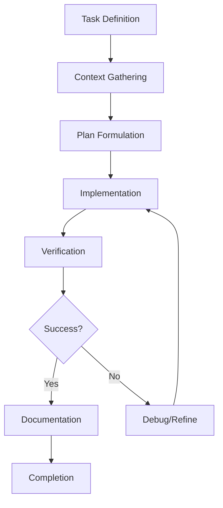
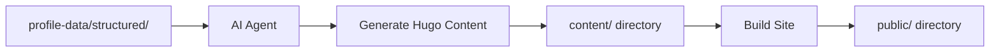
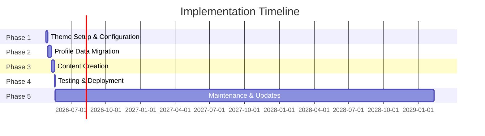

# Guiselle Armstrong Portfolio - Management Plan

**Project:** Professional Portfolio Site using Hugo Academic CV Theme  
**Target Platform:** GitHub Pages  
**Status:** Planning Phase  
**Created:** 2026-04-25

---

## Executive Summary

This Management Plan establishes the operational framework for building and maintaining Guiselle Armstrong's professional portfolio website. It defines AI agent workflows, file structure guidelines, content update procedures, version control practices, and progress tracking mechanisms to ensure efficient development and long-term maintainability.

---

## 1. AI Agent Workflow

### 1.1 Agent Interaction Model

This project utilizes AI agent assistance for development tasks. The following workflow ensures consistent, high-quality output.

#### Workflow Stages



#### Agent Role Guidelines

**Architect Mode:**
- Create and refine implementation plans
- Review file structures and configurations
- Design system architecture
- Plan content migration strategies

**Code Mode:**
- Execute file modifications
- Write and update content files
- Configure Hugo settings
- Implement technical changes

**Documentation Mode:**
- Update project documentation
- Create user guides
- Maintain README files
- Document API changes

### 1.2 Task Assignment Protocol

#### For Each Task:

1. **Define Clear Objective**
   - State the specific goal
   - Identify success criteria
   - Note any constraints

2. **Provide Context**
   - Reference relevant files
   - Include source data locations
   - Share any existing work

3. **Specify Output Format**
   - File paths
   - Content structure
   - Naming conventions

4. **Request Verification**
   - Ask for confirmation of completion
   - Specify acceptance criteria

### 1.3 Communication Patterns

#### Effective Prompts Include:

```
Task: [Clear action verb + objective]
Context: [Relevant file paths, data sources]
Input Data: [Source location or content]
Output: [Expected file path and format]
Constraints: [Any limitations or requirements]
```

#### Example Prompt:

```
Task: Create experience content block for NBCUniversal position
Context: Use theme's experience.md format as reference
Input Data: profile-data/structured/employment.json - NBCUniversal entry
Output: content/experience.md with new block appended
Constraints: Use bullet points for responsibilities, maintain existing format
```

### 1.4 Dev Container Workflow

**Objective:** Establish a consistent development environment using Docker Dev Containers.

#### Dev Container Setup

1. **Prerequisites**
   - Install Docker Desktop
   - Install VS Code with Dev Containers extension
   - Ensure Hugo version 0.159.2 is specified in `hugoblox.yaml`

2. **Starting Development**
   ```bash
   # Open project in Dev Container
   # VS Code will automatically detect .devcontainer/devcontainer.json
   # and prompt to reopen in container
   ```

3. **Dev Container Features**
   - Pre-configured Hugo environment (v0.159.2)
   - Port 1313 forwarding for Hugo dev server
   - VS Code extensions: Ownable, Hugo, Prettier
   - Automatic pnpm installation on container start

4. **Development Workflow**
   ```bash
   # Start Hugo dev server inside container
   hugo server -D --bind 0.0.0.0
   
   # Access site at http://localhost:1313
   # VS Code will notify when port is ready
   ```

5. **Benefits**
   - Consistent environment across all development machines
   - No local Hugo installation required
   - Isolated dependencies
   - Easy environment reset

---

## 2. File Structure Guidelines

### 2.1 Directory Organization

#### Recommended Structure

```
guiselle-portfolio/
├── hugo-theme-academic-cv/           # Theme directory (extracted from "copy")
│   ├── assets/                       # Theme assets
│   │   └── media/
│   │       └── authors/
│   │           └── me.png           # Profile image
│   ├── config/                       # Hugo configuration
│   │   └── _default/
│   │       ├── hugo.yaml            # Site configuration
│   │       ├── languages.yaml       # Language settings
│   │       ├── menus.yaml           # Navigation menus
│   │       ├── module.yaml          # Module dependencies
│   │       └── params.yaml          # Site parameters
│   ├── content/                      # Hugo content
│   │   ├── _index.md                # Homepage
│   │   ├── experience.md            # Experience section
│   │   ├── authors/
│   │   │   └── _index.md            # Authors index
│   │   ├── blog/                    # Blog posts (optional)
│   │   ├── courses/                 # Courses (optional)
│   │   ├── events/                  # Events (optional)
│   │   ├── projects/                # Projects
│   │   ├── publications/            # Publications (optional)
│   │   └── slides/                  # Slides (optional)
│   ├── data/                         # Hugo data
│   │   └── authors/
│   │       └── me.yaml              # Author profile
│   ├── layouts/                      # Custom templates
│   └── static/                       # Static assets
│       └── uploads/                 # Uploaded files
│           └── resume.pdf           # Resume document
├── profile-data/                     # Source profile data (read-only)
│   ├── raw/                          # Raw text extracts
│   ├── structured/                   # JSON structured data
│   ├── master-index.json            # Database index
│   └── README.md                    # Documentation
├── resumes/                          # Resume files (read-only)
│   ├── Guiselle Armstrong.pdf       # Primary resume
│   ├── Profile-2.pdf                # Secondary resume
│   └── [other resume variants]
└── .devcontainer/                    # Dev container configuration
    └── devcontainer.json            # Dev container settings
```
├── plans/                            # Project plans
│   ├── 01-implementation-plan.md    # Implementation plan
│   └── 02-management-plan.md        # Management plan
├── .gitignore                        # Git ignore rules
├── README.md                         # Project README
└── [Hugo-generated files]
    └── public/                       # Built site (gitignored)
```

### 2.2 File Naming Conventions

#### Content Files

| Type | Pattern | Example |
|------|---------|---------|
| Section index | `_index.md` | `content/projects/_index.md` |
| Single page | `slug.md` | `content/projects/vulnerability-management/index.md` |
| Data files | `name.yaml` or `name.json` | `data/authors/me.yaml` |

#### Configuration Files

| Type | Pattern | Example |
|------|---------|---------|
| Hugo config | `hugo.yaml` | `config/_default/hugo.yaml` |
| Parameters | `params.yaml` | `config/_default/params.yaml` |
| Menus | `menus.yaml` | `config/_default/menus.yaml` |

#### Asset Files

| Type | Pattern | Example |
|------|---------|---------|
| Profile image | `me.{png,jpg,jpeg}` | `assets/media/authors/me.png` |
| Resume | `resume.pdf` | `static/uploads/resume.pdf` |
| Project images | `{project-slug}-featured.{png,jpg}` | `content/projects/vulnerability-management/featured.jpg` |

### 2.3 Content File Structure

#### Experience Entry Format

```markdown
---
title: "Senior GRC Engineer"
organization: "NBCUniversal"
organization_url: ""
location: "United States"
date_start: "2023-03-01"
date_end: "9999-12-31"  # Use far future date for "Present"
description: |-
  - Managed vulnerability lifecycle for 500+ enterprise systems
  - Developed and delivered PCI DSS compliance training
  - Conducted user access review training for 200+ employees
---
```

#### Project Entry Format

```markdown
---
title: "Vulnerability Management Program"
external_url: ""
demo: ""
github: ""
thumbnail: "featured.jpg"
date: "2023-03-01"
draft: false
---

## Overview

Description of the project and its objectives.

## Technologies Used

- Nessus
- Qualys
- ServiceNow
- Power BI

## Outcomes

- 95% remediation rate achieved
- 50% reduction in manual reporting
```

### 2.4 Data Source Integrity

#### Source Data Protection

**Rule:** Never modify files in `profile-data/` or `resumes/` directories.

**Rationale:**
- These directories contain source of truth data
- Modifications should only occur in Hugo content directories
- Preserves ability to regenerate content from source

#### Content Generation Workflow



---

## 3. Content Update Procedures

### 3.1 Update Classification

#### Update Types

| Type | Description | Frequency |
|------|-------------|-----------|
| Minor | Typos, formatting, small additions | As needed |
| Major | New positions, certifications, projects | Quarterly |
| Structural | Theme updates, configuration changes | As needed |

### 3.2 Update Process

#### Step 1: Identify Change

- Determine update type (minor/major/structural)
- Identify affected files
- Note source data changes

#### Step 2: Gather Source Data

- Locate updated information in `profile-data/`
- Extract relevant JSON or text data
- Verify accuracy against original documents

#### Step 3: Implement Changes

- Use appropriate mode (architect/code/documentation)
- Follow file structure guidelines
- Maintain consistent formatting

#### Step 4: Verify Changes

- Build site locally
- Check for errors
- Review rendered content
- Test links and downloads

#### Step 5: Document Changes

- Update commit message
- Note changes in relevant documentation
- Update plan if scope has changed

### 3.3 Content Validation Checklist

Before committing any changes:

- [ ] All dates are in consistent format (YYYY-MM-DD for front matter)
- [ ] All links are valid and accessible
- [ ] Images are properly sized and optimized
- [ ] Content is accurate against source data
- [ ] No markdown syntax errors
- [ ] Front matter is valid YAML
- [ ] Site builds without errors
- [ ] Responsive design is maintained

---

## 4. Version Control Practices

### 4.1 Git Repository Setup

#### Initial Setup

```bash
# Initialize repository
git init

# Create .gitignore
# Include: public/, node_modules/, *.log, .hugo/

# Create initial commit
git add .
git commit -m "Initial commit: Hugo Academic CV theme setup"
```

#### Recommended .gitignore

```gitignore
# Hugo
public/
hugo/
*.tmp

# Dependencies
node_modules/

# IDE
.vscode/
.idea/
*.swp
*.swo

# OS
.DS_Store
Thumbs.db

# Build artifacts
*.log
```

### 4.2 Branching Strategy

#### Main Branches

| Branch | Purpose | Protection |
|--------|---------|------------|
| `main` | Production-ready code | Protected, requires PR |
| `develop` | Development integration | Optional |

#### Feature Branches

| Pattern | Example |
|---------|---------|
| `feature/description` | `feature/add-new-project` |
| `fix/description` | `fix/typo-experience-section` |
| `update/description` | `update/theme-v5.0` |

#### Branch Naming Convention

```
<type>/<short-description>
- type: feature, fix, update, refactor, docs
- short-description: lowercase, hyphen-separated, max 30 chars
```

### 4.3 Commit Message Convention

#### Format

```
<type>: <subject>

[optional body]

[optional footer]
```

#### Types

| Type | Description |
|------|-------------|
| `feat` | New content or feature |
| `fix` | Content correction |
| `docs` | Documentation update |
| `style` | Formatting changes |
| `refactor` | Code restructuring |
| `chore` | Maintenance tasks |
| `update` | Theme or dependency update |

#### Examples

```
feat: Add vulnerability management project

Added new project entry for NBCUniversal vulnerability management
program with technologies and outcomes.

fix: Update NBCUniversal end date

Corrected end date from "Present" to actual termination date.

update: Hugo Academic CV theme v5.0

Updated theme from v4.x to v5.0. Reviewed migration guide.
```

### 4.4 Release Management

#### Version Tagging

```bash
# Tag releases
git tag -a v1.0.0 -m "Initial portfolio release"
git tag -a v1.1.0 -m "Added projects section"
git tag -a v2.0.0 -m "Major content update"
```

#### Release Notes

Maintain `RELEASES.md` for tracking:

```markdown
# Release Notes

## v1.0.0 (2026-04-25)
- Initial portfolio launch
- Experience section complete
- Projects section added
- Resume download functional
```

---

## 5. Progress Tracking

### 5.1 Phase Tracking

#### Implementation Phases



#### Phase Status Tracking

| Phase | Status | Completion | Notes |
|-------|--------|------------|-------|
| 1. Theme Setup | [ ] | 0% | |
| 2. Data Migration | [ ] | 0% | |
| 3. Content Creation | [ ] | 0% | |
| 4. Testing & Deployment | [ ] | 0% | |
| 5. Maintenance | [ ] | 0% | |

### 5.2 Task Tracking

#### Task Status Codes

| Code | Meaning |
|------|---------|
| `TODO` | Not started |
| `IN_PROGRESS` | Currently working on |
| `DONE` | Completed |
| `BLOCKED` | Waiting on dependency |
| `REVIEW` | Pending review |

#### Task Template

```markdown
### Task: [Description]
- **Status:** [TODO/IN_PROGRESS/DONE/BLOCKED/REVIEW]
- **Phase:** [Phase number]
- **Priority:** [High/Medium/Low]
- **Dependencies:** [Other tasks]
- **Notes:** [Additional context]
```

### 5.3 Progress Reports

#### Weekly Status Report Template

```markdown
## Weekly Progress Report - [Date Range]

### Completed This Week
- [ ] Task 1
- [ ] Task 2

### In Progress
- [ ] Task 3

### Blocked
- [ ] Task 4 - Blocker: [Description]

### Next Week
- [ ] Planned task 1
- [ ] Planned task 2

### Issues/Concerns
- [Any blockers or concerns]
```

### 5.4 Milestone Tracking

#### Key Milestones

| Milestone | Criteria | Status |
|-----------|----------|--------|
| Theme Extracted | `hugo-theme-academic-cv-main copy/` renamed | Not Started |
| Config Complete | All config files updated | Not Started |
| Author Profile | `data/authors/me.yaml` complete | Not Started |
| Experience Migrated | All 12 positions in content | Not Started |
| Content Complete | All sections populated | Not Started |
| Site Built | `hugo` builds without errors | Not Started |
| Deployed | Site live on GitHub Pages | Not Started |
| First Review | Content accuracy verified | Not Started |

---

## 6. Quality Assurance

### 6.1 Content Accuracy

#### Verification Process

1. **Source Comparison**
   - Compare content against `profile-data/` JSON files
   - Verify dates, titles, organizations match
   - Check all responsibilities are included

2. **Cross-Reference**
   - Verify employment dates don't overlap incorrectly
   - Check education timeline is logical
   - Ensure certifications are current

3. **Professional Review**
   - Review for professional tone
   - Check for clarity and impact
   - Verify achievements are quantified

### 6.2 Technical Quality

#### Build Quality

- [ ] Site builds without warnings
- [ ] All CSS compiles correctly
- [ ] JavaScript loads without errors
- [ ] Images are optimized

#### Browser Compatibility

- [ ] Chrome (latest)
- [ ] Firefox (latest)
- [ ] Safari (latest)
- [ ] Edge (latest)
- [ ] Mobile Safari
- [ ] Mobile Chrome

### 6.3 SEO Quality

#### Meta Tags

- [ ] Title tag is present and descriptive
- [ ] Meta description is present
- [ ] Open Graph tags configured
- [ ] Twitter Card tags configured
- [ ] Canonical URL set

#### Content SEO

- [ ] Heading hierarchy is correct (H1, H2, H3)
- [ ] Alt text on images
- [ ] Internal linking is logical
- [ ] Sitemap is generated

---

## 7. Risk Management

### 7.1 Identified Risks

| Risk | Impact | Probability | Mitigation |
|------|--------|-------------|------------|
| Theme incompatibility | High | Medium | Test locally before deployment |
| Data migration errors | Medium | Medium | Verify against source JSON |
| Build failures | Medium | Low | Regular local testing |
| Deployment issues | Medium | Low | Follow GitHub Pages docs |
| Content accuracy | High | Medium | Source data verification |

### 7.2 Contingency Plans

#### If Build Fails
1. Check Hugo version compatibility
2. Review error messages
3. Check for missing dependencies
4. Consult theme documentation

#### If Deployment Fails
1. Verify repository settings
2. Check branch configuration
3. Review build logs
4. Contact GitHub support if needed

---

## 8. Appendix

### 8.1 Quick Reference Commands

```bash
# Local development
hugo server -D

# Build for production
hugo

# Check version
hugo version

# Clean build
rm -rf public/
hugo
```

### 8.2 Useful Resources

- [Hugo Documentation](https://gohugo.io/documentation/)
- [Hugo Academic CV Theme](https://docs.hugoblox.com/)
- [GitHub Pages Documentation](https://pages.github.com/)
- [YAML Syntax](https://learnxinyminutes.com/docs/yaml/)

### 8.3 Contact Information

| Item | Value |
|------|-------|
| Name | Guiselle Armstrong |
| Email | g_a25@outlook.com |
| LinkedIn | linkedin.com/in/guisellearmstrong-12217760 |
| Location | Auburndale, FL |

---

**Document Version:** 1.0  
**Last Updated:** 2026-04-25  
**Next Review:** Weekly or as needed
